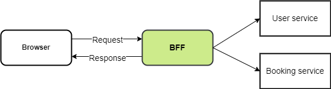

# Wellness booking portal
**1. Introduction**

Fullerton Healthcare Group is looking to build a wellness booking portal to facilitate information
transfer and booking of all activities and approval/rejection workflows.

**2. Folder structure**

This project contains 2 folders: client and server.

_2.1. Client_

Client was bootstrapped with [Create React App](https://github.com/facebook/create-react-app).

The components was built using [Ant Design](https://ant.design), followed Atomic Design.

_2.2. Server_

Server was followed Backend-For-Frontend (BFF) pattern, using [Express](https://expressjs.com) framework.

**3. Instructions**

_3.1. Install dependencies:_

- For client: `cd client && yarn`

- For server: `cd server && yarn`

_3.2. Start project:_

- Run UI: `cd client && yarn start`

- Run back-end: `cd server && yarn start` 

_3.3. Login:_

- HR 1:
> username: hr1 | password: user123

- HR 2:
> username: hr2 | password: user456

- Admin:
> username: admin1 | password: admin123
